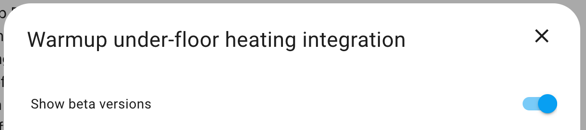
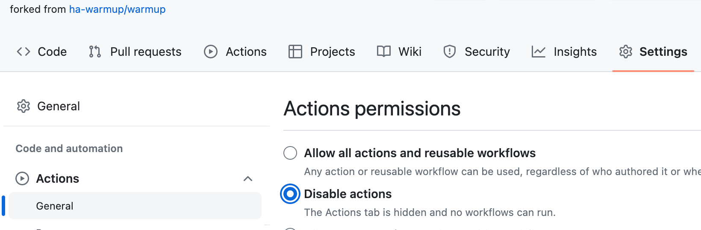

# Contributing

Thank you for your interest in helping out with this project.

In ascending order of complexity, here are ways you can get involved with this project:

* Issues
    * looking at [issues raised](https://github.com/ha-warmup/warmup/issues) and trying to advise users looking for help, or encouraging them to obtain useful diagnostics
* Documentation
    * increasing the detail, accuracy or readability in:
	    * our [documentation wiki](https://github.com/ha-warmup/warmup/wiki) (which you can edit directly) or 
	    * any of the readme files accompanying the code (which will require a pull request)
* Testing
	* when candidate fixes are posted against issues, you can load the modified code yourself and give it a go, to see if it works well under your own circumstances
* Coding (Development)
	* modifying the programme source code or configuration defaults in order to rectify reported issues, or to work on new features

## Testing

## Beta

If you are willing to help us test new features, 
before they are put on general release, 
you can set your HACS Integration (re-)download settings 
to `show beta versions`.



Please report any failure with specific messages or circumstance, in the relevant issue ticket. If you get none, then please report your success, so that we know we are closer to promoting the fix towards the main live release.

## Alpha testing

If you are suffering with a specific issue yourself, or are just happy to get involved in earlier testing, you can obtain earlier releases of code in different ways, depending on your setup.

Let's suppose that someone has submitted a Pull Request (PR) for a branch called `fix232_v2`, here are a couple of methods.

#### Alternative manual install

If you installed your set up manually, you can use the [alternative manual install method](https://github.com/ha-warmup/warmup?tab=readme-ov-file#alternative-versions) specifying the branch, e.g. 

```
git clone -b fix232_v2 https://github.com/ha-warmup/warmup.git /tmp/warmup
```

#### HACS install.service

You can install a specific branch on HASOS / HACS by calling the update.install service

```
service: update.install
data:
  version: fix232_v2
target:
  entity_id: update.warmup_under_floor_heating_integration_update
```

## Development

### Project Structure

For the time being, contributors have settled on a 
[project structure](https://github.com/ha-warmup/warmup/issues/50) 
that includes:

* HACS integration as a custom repository, with associated metadata files
* Instructions for manual install as custom_component
* incorporating any changes to the API-related python code in warmup4ie subfolder
	* and keeping a tracking copy in the root warmup4ie-PyPi folder for later

### Forking

As you will use a fork for your development we encourage you to 
familiarise yourself with the [Github guide to working with forks](https://help.github.com/en/github/collaborating-with-issues-and-pull-requests/working-with-forks).

If you Fork the project, it might tell you that 
workflows are being disabled on your fork. 
This is good, because they are currently 
designed only to work on the main fork, 
so you do NOT want to enable them. 
If, for any reason, your fork starts to notify you that 
you have Actions failing, then you should disable them: 



In your OWN fork:

* Settings / Actions / General
* Actions permissions = Disable
* remember to Save

Now the Actions tab should disappear from your fork, and the notifications will cease.

### Development practices
    
All development work should be done on branches created from the **dev** branch. 
Please ensure you understand [the branching model we follow](https://nvie.com/posts/a-successful-git-branching-model/).

Both of the above-linked guides also include command examples for you 
to work on your local project repository. 

Please raise an issue if you want further guidance on developing new features or fixing issues.

### Pull Requests

Once you have completed your development and testing on your changes, 
then please raise a Pull Request for us to be able to merge in your work. They should be merged into the **`dev`** branch.

You will see some validation actions launched as part of our HACS compliance. 
If any of these actions fail, then your Pull Request might be held back.

## Release

We use GitHub Releases as good practice, both for a github repo, and for a [HACS integration](https://hacs.xyz/docs/publish/integration/#github-releases-optional). Once the changes applied in the dev branch have been sufficiently tested, then they can be bundled up for a release into the `master` branch,

Before bringing changes into the **master** branch, please ensure that you have referenced the changes into [CHANGELOG.md](CHANGELOG.md) on dev. You could use `git log --oneline` to gather the info.

### Versioning

Since 2021.5.23, the versioning format has been YYYY.M.D (no leading zeroes). Note that HACS does not support the use of candidate suffixes - using a version like YYYY.M.D-beta may break the component. 

When releasing a version, please ensure that you update the version in 

```
custom_components/warmup/manifest.json
```

You may find it convenient to tag your release candidate with the version. 
When raising the PR from your origin/dev to the main project master, 
remember to ask for a new Github Release to be created with the same tag.

Please be clear if this is a Production release. 
Otherwise, when the Release is created 
it should be marked as a Pre-release. 
That way it will only be available to users who 
have selected the option 'show beta versions'. 
