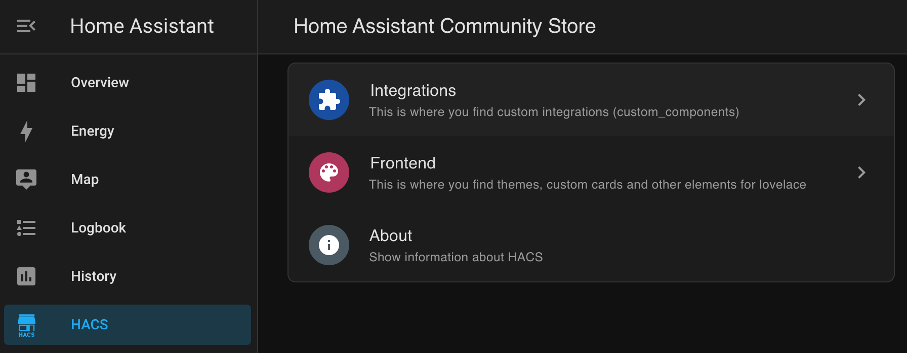
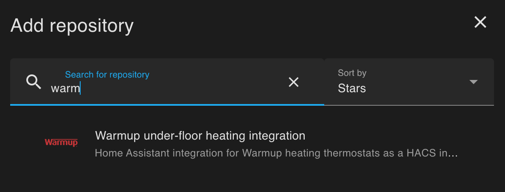
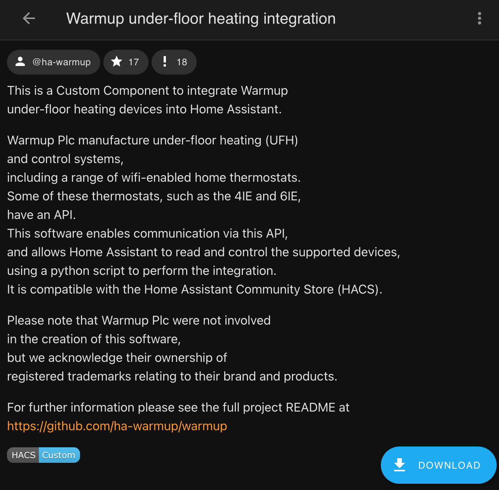
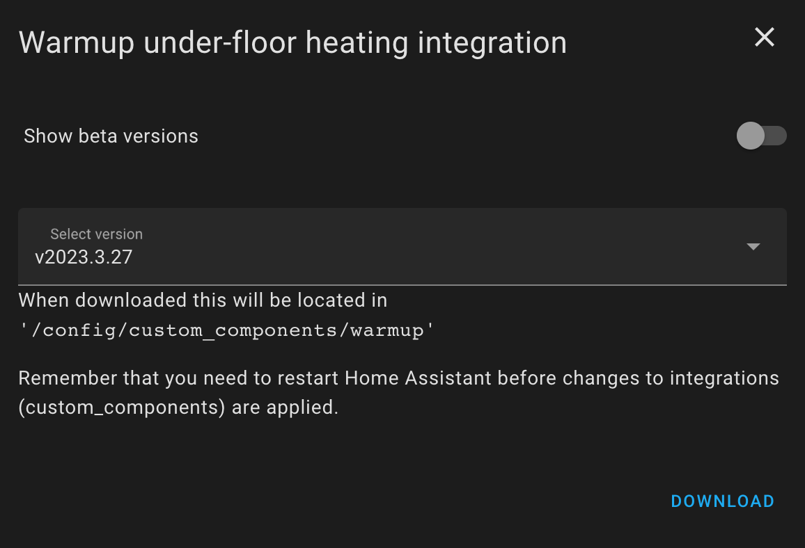
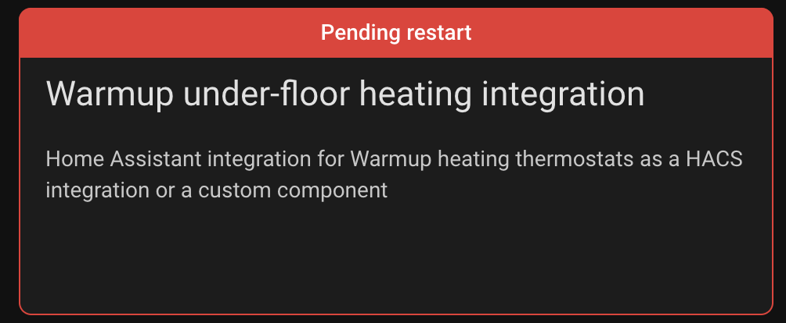
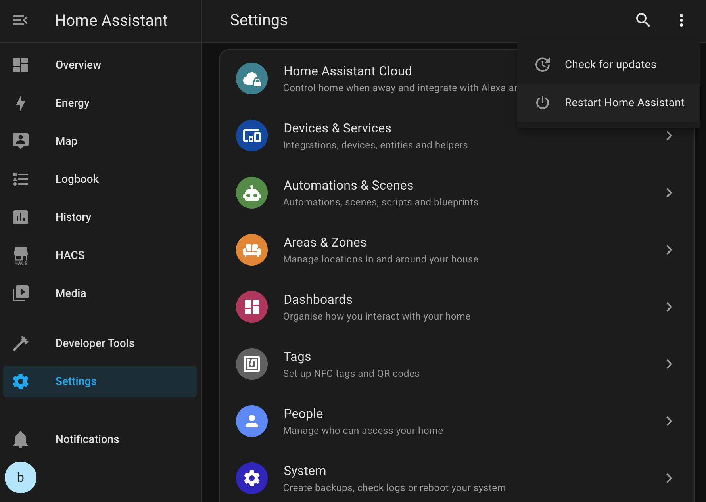
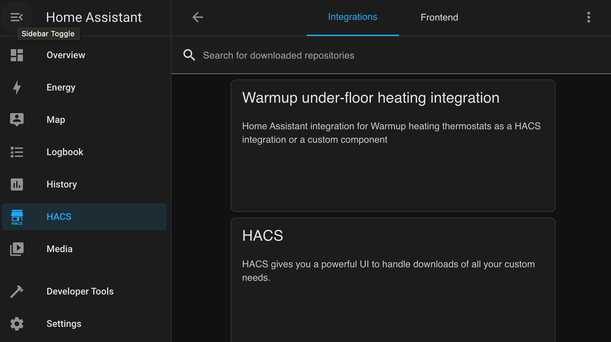

# Installing warmup in HACS

This assumes you have already installed the Home Assistant Community Store following the instructions 

https://hacs.xyz/docs/setup/prerequisites

If you want other kinds if installation, please see [README](../README.md).

## Default installation

### HACS / Integrations

[]
### HACS / Explore repos

[]

### Search for warmup

[]

### download Warmup

[]

### choose version

[]

### Pending restart

[
]

### Restart HA

[]

### done

[]

## Old instructions

### Custom Repository

In your HACS store, look in the _Integrations_ page. 
In the top right corner select the 3-dots menu, 
and choose _Custom repositories_. 
Paste in the URL to this repo, 

<https://github.com/ha-warmup/warmup/>

and select _Category_: **Integration**. 

For help see <https://hacs.xyz/docs/faq/custom_repositories/>

